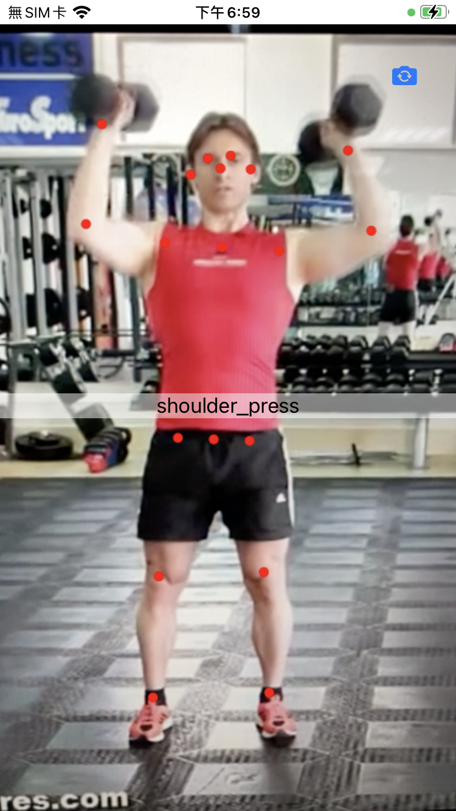

# VisionPose
Estimate body pose use Vision framework

At WWDC 2020, Apple add pose detection feature in new Vision framework, and it works very good.

Here is a demo project, use Viseion to detect body joints.

Burpee in landspcape.

[Instruction of training model for action classification (shoulder press / squat)] (https://chunpinglai.medium.com/action-classification-4c2819f6b69)

Recognize action - shoulder press / squat

